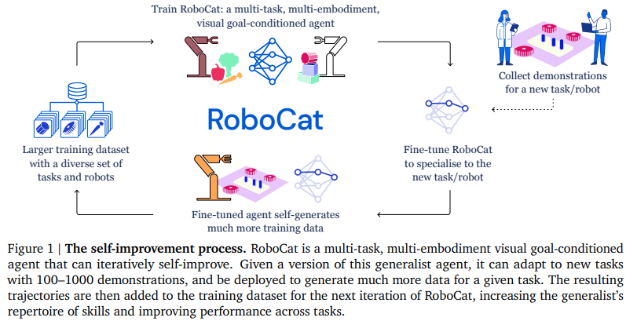

[](https://discord.gg/qUtxnK2NMf)


# ROBOTCAT


RoboCAT is a self-improving foundation agent for robotic manipulation developed by DeepMind Robotics. The model architecture of RoboCAT is similar to the RT-1 model. It follows a tokenization approach where robotics images, proprioception, and future actions are tokenized. 

* Help with the implementation in the Agora discord, 

----

# Install
`pip install robotcat` 

---

## Basic Usage

```python
import torch 
from robocat.model import RoboCat

model = RoboCat()

video = torch.randn(2, 3, 6, 224, 224)
instructions = [
    "bring me that apple"
]

result = model.forward(video, instructions)
print(result)

```


## Generate Data
* RoboCat can self generate data with images and or video, to use simply use the generator classes -> then tokenize and or tensorize using your custom strategy

```python
#for images
from robotcat import ImageDataGenerator

generator = ImageDataGenerator()

prompt = "Robot picking up cup in kitchen"
generator.generate(prompt)
```

and or for videos

```python
from robocat import VideoDataGenerator, RoboCat

generator = VideoDataGenerator()
model = RoboCat()

prompt = "Robot picking up cup in kitchen in first person"
video = generator.generate(prompt)
video = transform_to_tensors(video) #(batch, frames, actions, bins)

model(video, prompt)

```
----


## Architecture
The architecture consists of the following key components:

1. Tokenizer: RoboCAT learns a tokenizer for robotics images. It tokenizes proprioception and future actions in a straightforward manner, enabling the prediction of future action tokens.

2. Transformer Model: The tokenized inputs are fed into a Transformer model. The Transformer model predicts future action sequences based on the input tokens. This allows the model to perform a wide range of robotic tasks using a unified interface.

3. Action Spaces: RoboCAT predicts Cartesian 4 or 6 degrees of freedom (DoF) cartesian velocities for the arm and 1 DoF (parallel jaw gripper) or 8 DoF (3-finger) for the hand. This flexible approach enables the model to handle action spaces of different sizes and variable proprioception sizes.

The architecture of RoboCAT allows for the integration of multiple robot embodiments with a unified interface. By predicting the appropriate number of tokens based on the robot's morphology, the model can effectively scale without the need for separate prediction heads for each embodiment.


## Misc Components

### Generalization and Transfer Learning
The RoboCAT paper focuses on studying generalization and transfer learning. It explores how training on one domain benefits testing on another and investigates the effectiveness of transfer learning from simulation to the real world. The authors provide empirical data on cross-task transfer, architecture scaling, and tokenization strategies for perception.

### Evaluation and Automated Testing
RoboCAT emphasizes the importance of rigorous evaluation and presents methodologies for automated evaluation of multi-task policies in real-world settings. The paper provides details on evaluation protocols, data collection, and comparative analysis of different models and approaches.

### Real-World Robotic Tasks
The paper highlights the challenges of real-world robotics tasks and the significance of cross-robot transfer. The authors showcase consistent results across multiple robots and action spaces, demonstrating the value of collecting real-world data for training and evaluation. The effort put into data set detailing and evaluation protocols is commendable.

### Future Directions and Reproducibility
The authors acknowledge the ongoing challenge of reproducibility in robotics research. They emphasize the need for independent replication in different labs and variations in manipulation tasks and hardware. The paper raises questions about the impact of experimental choices and engineering decisions on research outcomes and

 calls for advancements in evaluation methodologies.

## Conclusion

The RoboCAT paper presents a self-improving foundation agent for robotic manipulation that addresses the challenges of generalization and transfer learning in the field of robotics. It offers insights into the model architecture, requirements, and experimental findings. The extensive empirical data, evaluation protocols, and comparisons provide valuable contributions to the research community.

# Roadmap

* Functional prototype

* Integrate VQGAN to generate an image when it has not encountered an known environment

` environment observation -> environment familarity rating [0.0-1.0] -> generate data if lower then [0.5] -> finetune -> action`

* Train on massive datasets

* Finetune as specified on paper

* Release as paid API

* Integrate more modalities like hearing, 3d mapping, nerfs, videos, lidar, locomotion, and the whole lot!


## Citations

```bibtex
@article{Bousmalis2023RoboCat,
    title   = {RoboCat: A Self-Improving Foundation Agent for Robotic Manipulation},
    author  = {Konstantinos Bousmalis*, Giulia Vezzani*, Dushyant Rao*, Coline Devin*, Alex X. Lee*, Maria Bauza*, Todor Davchev*, Yuxiang Zhou*, Agrim Gupta*,1, Akhil Raju, Antoine Laurens, Claudio Fantacci, Valentin Dalibard, Martina Zambelli, Murilo Martins, Rugile Pevceviciute, Michiel Blokzijl, Misha Denil, Nathan Batchelor, Thomas Lampe, Emilio Parisotto, Konrad Żołna, Scott Reed, Sergio Gómez Colmenarejo, Jon Scholz, Abbas Abdolmaleki, Oliver Groth, Jean-Baptiste Regli, Oleg Sushkov, Tom Rothörl, José Enrique Chen, Yusuf Aytar, Dave Barker, Joy Ortiz, Martin Riedmiller, Jost Tobias Springenberg, Raia Hadsell†, Francesco Nori† and Nicolas Heess},
    journal = {ArXiv},
    year    = {2023}
}
```


